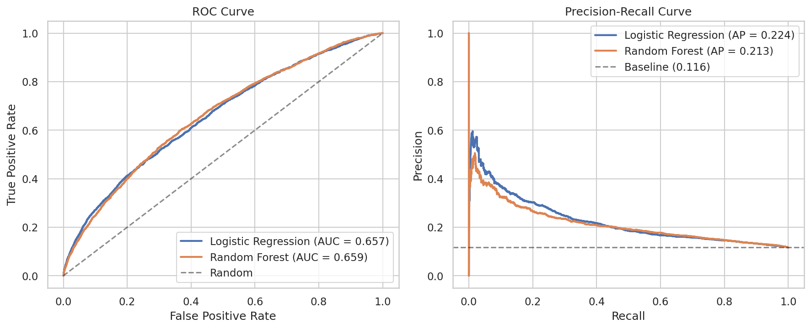
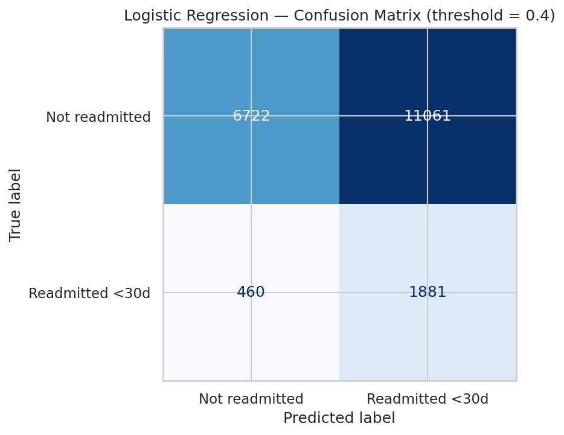
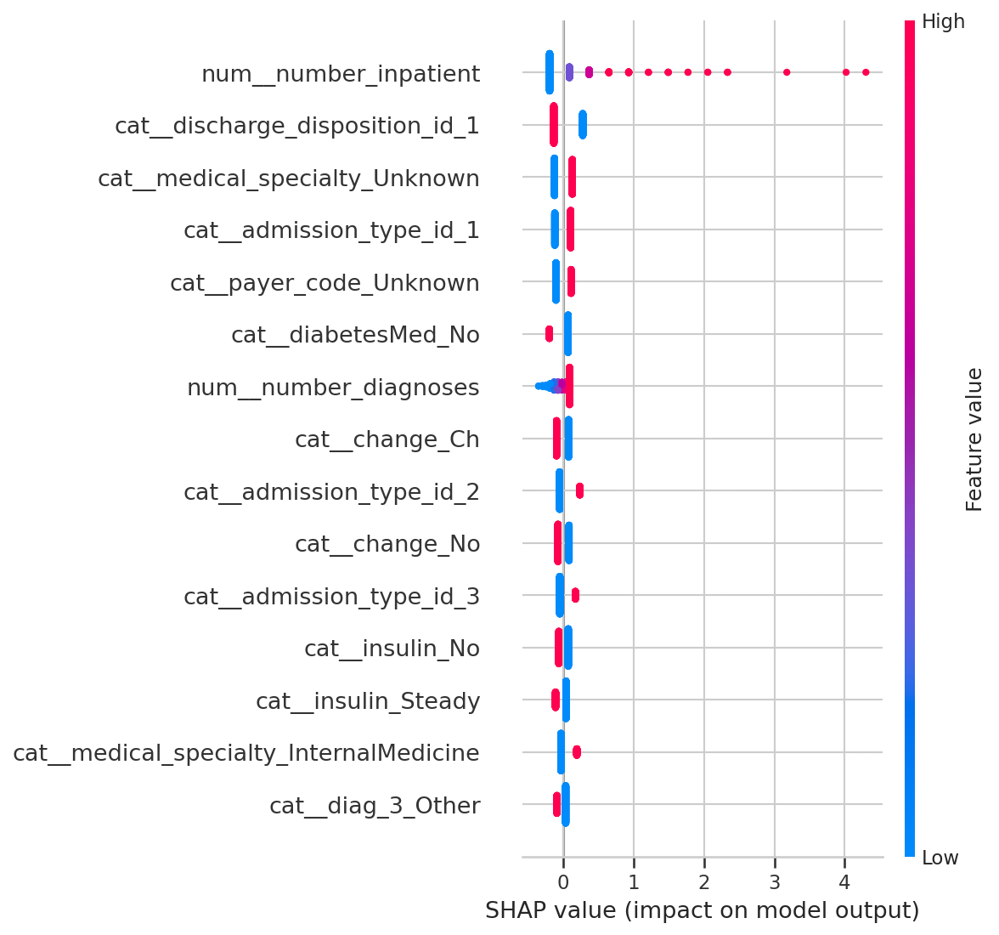

# 30-Day Hospital Readmission Prediction in Diabetic Patients

Predicting unplanned 30-day hospital readmission for diabetic patients using
clinical data from 130 US hospitals (1999–2008).

## Problem

Hospital readmissions within 30 days of discharge are a key quality-of-care
indicator and a major cost driver for healthcare systems (CMS penalizes excess
30-day readmissions in the US). This project builds a binary classifier to
predict whether a diabetic patient will be readmitted within 30 days based on
their hospital encounter data.

## Dataset

UCI Diabetes 130-US Hospitals (1999–2008) — 101,766 encounters across 71,518
unique patients, 50 features. License: CC BY 4.0.

[Source](https://archive.ics.uci.edu/dataset/296/diabetes+130-us+hospitals+for+years+1999-2008)

## Methodology

### Patient-level split

The dataset contains multiple encounters per patient (mean 1.42, max 40+).
Splitting by encounter introduces data leakage: the same patient appears in
both train and test sets, inflating performance. We split by `patient_nbr` so
each patient appears in only one split. This is the single most important
preprocessing decision and the main reason published benchmarks for this
dataset land at AUC ≈ 0.65, not 0.85+.

###  Filtering

Patients discharged to hospice or who died (`discharge_disposition_id` in
{11, 13, 14, 19, 20, 21}) cannot be readmitted and are excluded from the
modeling set (2,423 encounters removed).

### Target

Three-class `readmitted` recoded to binary: 1 if readmission occurred within
30 days, 0 otherwise (including >30 days and no readmission). Positive class
rate after filtering: 11.4%.

### Features

- `weight` dropped (97% missing).
- `payer_code`, `medical_specialty`, `race`: missing recoded as `"Unknown"`
  (informative missingness — SHAP confirms these recoded categories carry
  signal).
- `A1Cresult`, `max_glu_serum`: missing recoded as `"None"` (test not
  performed is itself informative).
- ICD-9 diagnosis codes (`diag_1`, `diag_2`, `diag_3`) grouped into 9
  clinical categories following Strack et al. (2014): Circulatory,
  Respiratory, Digestive, Diabetes, Injury, Musculoskeletal, Genitourinary,
  Neoplasms, Other.
- `age` ranges (e.g. `[70-80)`) converted to midpoints.
- `admission_type_id`, `discharge_disposition_id`, `admission_source_id`
  treated as categorical despite being integer-coded (no ordinal meaning).

### Models

- **Logistic Regression** (baseline, chosen final model)
- **Random Forest** (n_estimators=200, max_depth=10)

Both with `class_weight='balanced'` to handle the 11% positive class rate.
5-fold stratified cross-validation on the train set; final evaluation on a
held-out test set (20% of patients).

## Results

| Model               | CV ROC-AUC      | Test ROC-AUC | Test PR-AUC |
|---------------------|-----------------|--------------|-------------|
| Logistic Regression | 0.6664 ± 0.0029 | 0.6567       | 0.2242      |
| Random Forest       | —               | 0.6591       | 0.2130      |

Baseline PR-AUC (random classifier): 0.116.

Results align with the published benchmark of ≈0.65 for this dataset. The
two models perform equivalently, suggesting that the signal ceiling is here.
Logistic Regression is chosen as the final model for its interpretability,
training speed, and ease of communication in clinical settings.



### Threshold selection

The default threshold of 0.5 is rarely optimal in clinical contexts where the
cost of a false negative (missed readmission) exceeds the cost of a false
positive (unneeded follow-up). At threshold 0.4, the model achieves 80%
recall at the cost of low precision (14.5%) — a reasonable trade-off if the
intervention is cheap (e.g., follow-up call). The optimal threshold is a
business decision, not a statistical one.



##  Key Findings



The strongest predictor is the number of prior inpatient admissions
(`number_inpatient`) — patients with multiple prior hospitalizations are
consistently more likely to be readmitted, consistent with clinical intuition
that prior healthcare utilization is the dominant signal.

Other strong predictors include the discharge disposition (whether the
patient was sent home or to another facility), the medical specialty handling
the admission, and the number of diagnoses (a proxy for comorbidity burden).
SHAP also reveals that the *Unknown* categories for `medical_specialty` and
`payer_code` carry predictive signal — confirming the choice to recode
missingness as a category rather than impute it.

## Limitations and Future Work

- Data is from 1999–2008 and US-only; generalization to current European
  healthcare systems is not guaranteed.
- No socioeconomic variables (income, area deprivation indices).
- ICD-9 has been replaced by ICD-10 in clinical practice; recoding would be
  needed for current data.
- A gradient-boosted model (XGBoost / LightGBM) with hyperparameter tuning
  could provide a small improvement; left as future work.

## Repository Structure

```
diabetes-readmission/
├── notebooks/
│   ├── 01_eda_preprocessing.ipynb
│   └── 02_modeling.ipynb
├── src/
│   └── preprocessing.py
├── figures/
│   ├── roc_pr_curves.png
│   ├── confusion_matrix.png
│   └── shap_summary.png
├── requirements.txt
├── .gitignore
└── README.md
```

## Reproducing

```bash
git clone https://github.com/arnau353-lab/diabetes-readmission.git
cd diabetes-readmission
python3 -m venv .venv
source .venv/bin/activate
pip install -r requirements.txt
# Download the dataset from the UCI link above and place
# diabetic_data.csv in data/
jupyter notebook notebooks/
```

Random seed fixed at 42 throughout for reproducibility.

## References

Strack, B. et al. (2014). *Impact of HbA1c Measurement on Hospital Readmission
Rates: Analysis of 70,000 Clinical Database Patient Records*. BioMed Research
International. DOI: 10.1155/2014/781670